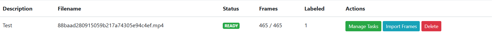
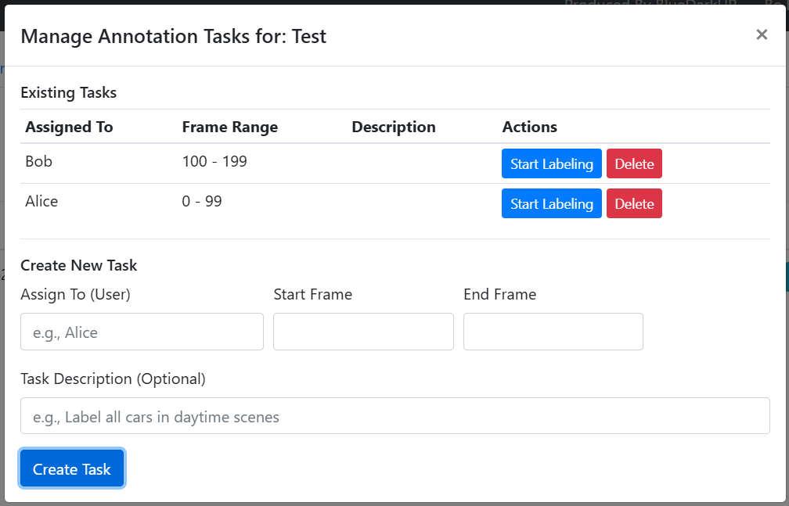
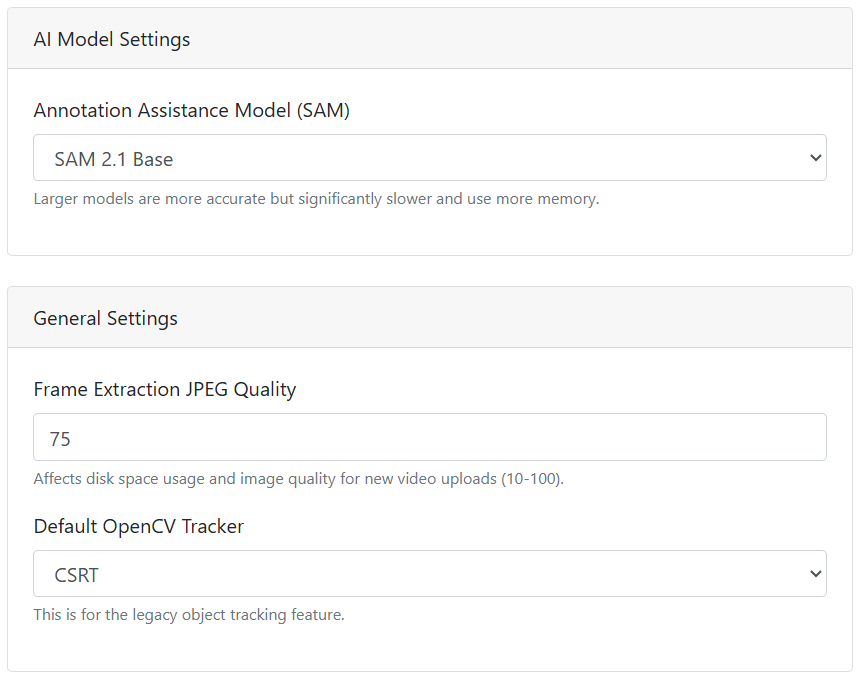

### 阅读之前：已经有数据集？
  - #### 使用[Yolo2TFRecord](https://github.com/BlueDarkUP/Yolo2TFRecord)轻松的将YOLOv8格式数据集转换为TFRecord
  - #### 使用[FTC-Easy-TFLITE](https://github.com/BlueDarkUP/FTC-Easy-TFLITE)轻松构建从搭建环境到导出模型的简单流水线

# Zero-to-YOLO-Yard: 本地化机器学习标注工具

*   [English README (英文 README)](README-EN.md)

**Zero-to-YOLO-Yard** 是一个深度定制的 [FMLTC (FIRST Machine Learning Toolchain)](https://github.com/FIRST-Tech-Challenge/fmltc) 版本，专为在本地计算机上高效运行而设计，无需依赖任何云服务。它专注于提供一个从视频到数据集的完整解决方案，是机器人、无人机或其他计算机视觉项目理想的本地化数据处理工具。

[](https://www.python.org/downloads/release/python-3100/)
[](https://opensource.org/licenses/MIT)
[]()

---

## ✨ 核心功能

- **🎬 视频管理**: 轻松上传和管理您的 `.mp4` 或 `.mov` 格式的视频文件。
- **🖼️ 智能帧提取**: 自动将视频分解为图像帧，或直接导入已有的图片文件夹。
- **✍️ 精准图像标注**: 通过直观的界面在图像帧上绘制边界框（Bounding Box）并分配类别标签。
- **🤖 AI 辅助标注与跟踪**:
    - **SAM 2.1 集成**: 利用 [Segment Anything Model 2.1](https://segment-anything.com/)，通过简单的点击即可自动生成高质量的边界框。
    - **自动对象跟踪**: 在一帧中标注对象后，即可在后续所有帧中自动跟踪，大幅提升效率。
- **📦 一键数据集导出**: 将已标注的帧导出为 YOLO 格式，并打包为 `.zip` 文件，方便直接用于模型训练。
- **🧠 模型管理**: 支持导入和管理您在其他平台训练好的 `.tflite` 模型。

## 🚀 快速上手

### 1. 环境配置

在开始之前，请确保您的系统中已安装 **Python 3.10**。

**克隆项目**
```bash
git clone https://github.com/BlueDarkUP/Zero2YoloYard.git
cd Zero-to-YOLO-Yard
```

**安装依赖**
我们建议使用虚拟环境来管理项目依赖。

```bash
# 创建虚拟环境 (可选但推荐)
python -m venv venv
source venv/bin/activate  # on Windows use `venv\Scripts\activate`

# 安装所有必需的库
pip install -r requirements.txt
```

### 2. 启动应用

一切准备就绪后，在项目根目录下运行以下命令启动 Web 服务器：

```bash
python app.py
```

服务器成功启动后，您将在终端看到如下输出：
```
 * Running on http://127.0.0.1:5000
```

现在，打开您的浏览器并访问 [http://127.0.0.1:5000](http://127.0.0.1:5000) 即可开始使用！

---

## 📖 工作流程指南

### 步骤 1: 上传数据

1.  导航至 **"Videos"** 选项卡。
2.  点击 **"Upload Video"** 并选择您的视频文件，为其指定一个项目名称。
3.  系统将自动开始处理视频，状态会依次显示为 `UPLOADING` -> `EXTRACTING` -> `READY`。
4.  您也可以通过点击 **"Import Frame"** 直接导入一个包含图片的文件夹作为数据集。



### 步骤 2: 分配标注任务

对于团队协作，您可以清晰地划分每个成员的工作范围。

1.  当视频状态变为 `READY` 后，点击 **"Manage Tasks"**。
2.  在 **"User"** 字段中输入团队成员的名称。
3.  在 **"Start Frame"** 和 **"End Frame"** 中定义该成员负责标注的帧范围。



### 步骤 3: 开始标注

1.  在任务列表中找到自己的名字，点击 **"Start Labeling"** 进入标注界面。
2.  在右侧边栏中 **新建或选择一个类别 (Class)**。
3.  **手动标注**:
    - 在图像中按住并拖动鼠标，绘制边界框 (BBox)。
    - 完成后按 `S` 键或点击 **"Save BBoxes"** 保存当前帧的标注。
    - 使用 `A` / `D` 键或拖动下方进度条来切换帧。
    - 新标注的 BBox 会被自动选中，您可以直接按 `Delete` 或 `Backspace` 将其删除。

### 步骤 4: AI 辅助标注

为了进一步提升效率，我们集成了强大的 SAM 2.1 模型。

**模型配置**
1.  返回主界面，点击 **"Settings"**。
2.  在这里，您可以选择不同的 SAM 模型（如 `Tiny`, `Small`, `Base`, `Large`），前提是模型文件已存放于 `checkpoints` 文件夹中。
3.  跟踪器默认使用 **CSRT**，性能均衡，通常无需修改。



**智能标注与跟踪**
- **辅助标注 (SAM)**:
    1.  在标注界面的右侧边栏点击 **"Enable SAM"**。
    2.  此时鼠标光标将变为指针状。您只需在希望标注的物体上点击，SAM 将自动为您生成精确的边界框。
- **自动跟踪 (SAM Tracker)**:
    1.  在一帧中完成所有对象的标注后，点击 **"Track Object with SAM2"**。
    2.  系统将从当前帧开始，自动跟踪您标注的所有对象，直到视频结束。您可以随时暂停进程并进行手动修正。

### 步骤 5: 生成并导出数据集

1.  返回主界面，进入 **"Dataset"** 选项卡。
2.  点击 **"Create Dataset"**，填写数据集名称等信息。
3.  通过 **"Select Videos"** 关联一个或多个已完成标注的项目。
4.  设定验证集在总数据中的占比（例如 `20` 代表 20%）。
5.  创建成功后，点击数据集旁的 **"Download"** 即可获取 YOLO 格式的 `.zip` 压缩包。

> **重要提示**: 如果您在链接数据集后修改了任何标注，需要重新创建一个新的数据集以包含这些更改。

---

## 📂 文件结构

项目的所有数据都存储在本地，确保了数据的私密性和安全性。

-   **`local_storage`**: 包含所有上传的视频、提取的帧、数据集和模型文件。
-   **`ftc_ml.db`**: 一个 SQLite 数据库文件，用于保存视频描述、标注信息、任务分配等所有元数据。

## 🤝 贡献与致谢

本项目是对 [FIRST-Tech-Challenge/fmltc](https://github.com/FIRST-Tech-Challenge/fmltc) 的改进和本地化实现。

特别感谢 **BlueDarkUP** 在项目开发中的贡献。

欢迎通过 Pull Request 或 Issues 为该项目做出贡献！
