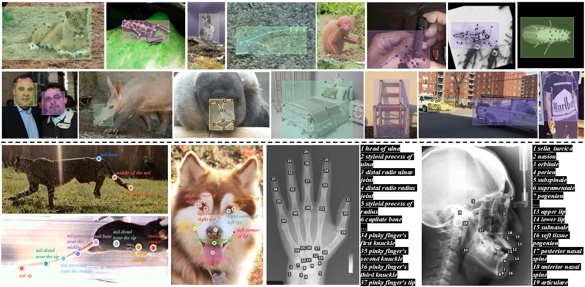

# MegaKPT: A Large-Scale High-Quality GKD Dataset

## 1. Introduction
**MegaKPT dataset** unifies 29 public keypoint datasets into the same annotation format, namely, COCO format, resulting over 1.3 million object instances. Moreover, we correct noisy annotations, supplement accurate keypoint texts, and give clear super-categories and indexes, rendering a high-quality and convenient-to-use dataset. **To our best knowledge, MegaKPT is the largest unified dataset in the field**. A glance of MegaKPT is shown in below image:

All images have both keypoint and text annotations. ***(top)*** Visualize keypoints only; ***(bottom)*** Visualize both keypoints and texts. The dataset covers large diversity of objects from various scenes.

## 2. Statistics \& Download
We credit each dataset source. The statistics of MegaKPT are as follows:
| Super-category | Dataset | Category | Keypoint | Image | Instance |
|---|---|---|---|---|---|
| Human pose | [COCO](https://cocodataset.org/#download) | 1 | 17 | 66,808 | 273,469 |
|  | [Human-Art](https://github.com/idea-research/humanart) | 1 | 21 | 50,000 | 123,131 |
| Human face | 300W | 1 | 68 | 600 | 600 |
|  | HELLEN | 1 | 68 | 2,330 | 2,330 |
|  | AFW | 1 | 68 | 337 | 337 |
|  | IBUG | 1 | 68 | 135 | 135 |
|  | LFPW | 1 | 68 | 1,035 | 1,035 |
|  | AFLW | 1 | 21 | 25,993 | 25,993 |
| Human limbs | OneHand10K | 1 | 21 | 11,703 | 11,289 |
|  | HInt | 1 | 21 | 17,281 | 17,281 |
| Animal pose | Animal | 5 | 20 | 4,666 | 6,117 |
|  | [AwA pose](https://github.com/prinik/AwA-Pose) | 35 | 39 | 10,064 | 10,064 |
|  | [CUB](https://www.vision.caltech.edu/datasets/cub_200_2011/) | 200 | 15 | 11,788 | 11,788 |
|  | [NABird](https://dl.allaboutbirds.org/nabirds) | 555 | 11 | 48,562 | 48,562 |
|  | [AP-10K](https://www.kaggle.com/datasets/imllti/ap-10k) | 54 | 17 | 10,015 | 13,028 |
|  | [APT-36K](https://github.com/pandorgan/APT-36K) | 30 | 17 | 35,708 | 48,704 |
|  | [MacaquePose](https://www.pri.kyoto-u.ac.jp/datasets/macaquepose/index.html) | 1 | 17 | 13,083 | 16,393 |
|  | ATRW (tiger) | 1 | 15 | 2,830 | 2,830 |
|  | AcinoSet (cheetah) | 1 | 20 | 5,795 | 5,795 |
|  | [Animal Kingdom](https://github.com/sutdcv/Animal-Kingdom) | 850 | 23 | 33,000 | 99,267 |
|  | TopViewMouse-5K | 1 | 27 | 5,000 | 5,000 |
| Insect pose | Vinegar Fly | 1 | 32 | 1,500 | 1,500 |
|  | Desert Locust | 1 | 35 | 700 | 700 |
| Animal face | [AnimalWeb](https://fdmaproject.wordpress.com/) | 350 | 9 | 22,451 | 21,921 |
| Furniture | Keypoint-5 | 5 | 8–14 | 8,649 | 8,649 |
| Vehicle | [CarFusion](https://www.cs.cmu.edu/~ILIM/projects/IM/CarFusion/cvpr2018/index.html) | 3 | 14 | 53,000 | 100,000 |
| Clothes | [DeepFashion2](https://github.com/switchablenorms/deepfashion2) | 13 | 8–39 | 491,000 | 491,000 |
| Medical SC | Cephalometric | 1 | 19 | 400 | 400 |
|  | Hand X-ray | 1 | 37 | 910 | 910 |
| Accumulated | **29** | **1587** | **740** | **935,343** | **1,348,228** |


**Download notes:**
- We release the MegaKPT unified annotations of all component datasets in [HuggingFace](https://huggingface.co/datasets/changshenglu/MegaKPT/tree/main). For the datasets that are without hyperlinks in the above table, their image data is included as well since they may be not easily downloaded or have some corrections. 
- For the datasets that are with hyperlinks,  you can download their image data stably via the links shown in the above table, and then place the image data into the corresponding folder in MegaKPT. You can double check `/your/path/to/General-Keypoint-Detection/datasets/dataset_meta_info.py` which registers relative paths of each dataset.
- We provide `your/path/to/MegaKPT/vehicle/carfusion/download_via_code.py` to download the CarFusion dataset for your convenience
- Please use our provided unified annotation files in HuggingFace (instead of the original ones)
- We group `300W, HELLEN, AFW, IBUG, LFPW` into one folder with the name 300w in our released MegaKPT as they share the same number of annotated facial keypoints.

**MegaKPT folder layout:**
```
|-- /your/path/to/MegaKPT/
|   |-- animal_face/
|   |   |-- animalweb/
|   |-- animal_pose/
|   |   |-- acinoset_cheetah/
|   |   |-- animal_kingdom/
|   |   |-- animal_pose_dataset/
|   |   |-- ap10k/
|   |   |-- apt36k/
|   |   |-- atrw_tiger/
|   |   |-- awa_pose/
|   |   |-- cub/
|   |   |-- macaque_pose/
|   |   |-- nabird/
|   |   |-- topviewmouse5k/
|   |-- clothes/
|   |   |-- deepfashion2/
|   |-- furniture/
|   |   |-- keypoint-5/
|   |-- human_face/
|   |   |-- 300w/
|   |   |-- aflw/
|   |-- human_limbs/
|   |   |-- hint/
|   |   |-- onehand10k/
|   |-- human_pose/
|   |   |-- coco/
|   |   |-- human_art/
|   |-- insect_pose/
|   |   |-- desert_locust/
|   |   |-- vinegar_fly/
|   |-- medical/
|   |   |-- cephalometric_landmark/
|   |   |-- hand_xray/
|   |-- vehicle/
|   |   |-- carfusion/
```


## 3. License
We do not own the copyrights to these images. Their use is restricted to non-commercial research and educational purposes.


## 4. Citation
If you find our work helpful, please give us a star and cite our paper, thank you!
```
@inproceedings{lu2026gkdt,
  title={GKDT: General Keypoint Detection Transformer},
  author={Lu, Changsheng and Chen, Yuxin and Gui, Haokun and Wang, Rong and Yang, Jie and Yang, Harry and Hengel, Anton van den and Jia, Jiaya},
  booktitle={European Conference on Computer Vision},
  year={2026},
  organization={Springer}
}
@inproceedings{lu2024openkd,
  title={Openkd: Opening prompt diversity for zero-and few-shot keypoint detection},
  author={Lu, Changsheng and Liu, Zheyuan and Koniusz, Piotr},
  booktitle={European Conference on Computer Vision},
  pages={148--165},
  year={2024},
  organization={Springer}
}
@inproceedings{lu2022few,
  title={Few-shot keypoint detection with uncertainty learning for unseen species},
  author={Lu, Changsheng and Koniusz, Piotr},
  booktitle={2022 IEEE/CVF Conference on Computer Vision and Pattern Recognition (CVPR)},
  pages={19394--19404},
  year={2022},
  organization={IEEE}
}
```