# General-Keypoint-Detection

## Table of Contents
- [1. Introduction](#1-introduction)
- [2. Released GKDT Models](#2-released-gkdt-models)
- [3. Environment Setup](#3-environment-setup)
- [4. Real-World Testing & Applications](#4-real-world-testing--applications)
  - [4.1 Download Models](#41-download-models)
  - [4.2 Single-Object General Keypoint Detection](#42-single-object-general-keypoint-detection)
  - [4.3 Multi-Object General Keypoint Detection](#43-multi-object-general-keypoint-detection)
- [5. MegaKPT Dataset](#5-megakpt-dataset)
- [6. Model Training and Evaluation](#6-model-training-and-evaluation)
- [7. Continual Learning on Your Dataset](#7-continual-learning-on-your-dataset)
- [8. License](#8-license)
- [9. Citation](#9-citation)

## 1. Introduction
- This is the source code implementation for the ECCV 2026 paper [GKDT: General Keypoint Detection Transformer](https://arxiv.org/pdf/2607.00752)
- The major contributions of this work are in two aspects: 1) We present ***a powerful yet highly practical foundation model, called GKDT, for general keypoint detection with state-of-the-art performance***. GKDT supports visual prompt, text prompt, and both, enabling few-shot, zero-shot, and multimodal prompted detection. GKDT is open-world, thus it also supports continual learning on new categories. To our best knowledge, GKDT is the first DINOv3 based model for general keypoint detection (GKD); 2) We present ***a large-scale high-quality dataset MegaKPT that unifies 29 public datasets with over 1.3 million object instances*** for the research of general keypoint detection.
- This repository is the first one with codes, models, and dataset completely open-source in the field of general keypoint detection.


## 2. Released GKDT Models
We release two sets of GKDT models. One is trained using the entire MegaKPT dataset (including training, validation and/or test sets of each component dataset) to pursue great performance for real-world testing and applications; Another set is only trained by the combination of training sets of each component dataset for the purpose of research. The model variants GKDT-L (default model in our paper) and GKDT-H use the DINOv3-L and DINOv3-H visual backbones, respectively.
 
### 2.1 For real-world testing & application
Results across 22 datasets' test sets with 1000 episodes and metric PCK@0.1:
|        |Prompt|Animal|AwA  |CUB  |NABird|AP-10K|Vinegar fly|Locust|Mourse5k|Macaque|Tiger|Animal Kin.|COCO val|HumanArt|300W |Ani.Web|OneHand|HInt |Keypoint-5|CarFusion|D.Fashion2|Cephalo|Hand X-ray|
|--------|:----:|:----:|:---:|-----|:----:|:----:|:---------:|:----:|:------:|:-----:|:---:|:---------:|:------:|:------:|:---:|:-----:|:-----:|:---:|:--------:|:-------:|:--------:|:-----:|:--------:|
|GKDT-L  |visual|89.13 |94.84|98.79|97.99 |95.52 |99.42      |99.32 |98.46   |91.45  |95.86|96.70      |90.59   |88.93   |98.52|95.28  |97.77  |88.85|97.46     |97.51    |91.19     |99.98	 |100.00    |
|        |text  |94.02 |97.08|99.34|98.27 |96.78 |99.89      |99.80 |98.55   |95.05  |97.75|97.74      |94.46   |94.32   |99.76|97.47  |98.90  |94.26|98.62     |98.13    |95.31     |99.98	 |100.00    |
|        |both  |93.12 |96.80|99.28|98.24 |96.50 |99.86      |99.74 |98.56   |94.62  |97.56|97.62      |94.51   |93.70   |99.68|97.42  |98.73  |93.45|98.42     |97.91    |94.64     |99.98	 |100.00    |
|GKDT-H  |visual|92.10 |95.69|99.22|98.85 |97.32 |99.56      |99.33 |98.72   |91.97  |97.03|98.42      |92.33   |91.20   |99.13|96.79  |98.39  |93.63|98.52     |98.17    |91.24     |100.00 |100.00    |
|        |text  |95.48 |98.49|99.56|99.04 |98.29 |99.95      |99.74 |98.76   |95.88  |98.34|98.96      |95.56   |96.03   |99.93|98.81  |99.36  |97.05|99.16     |98.80    |95.56     |100.00 |100.00    |
|        |both  |94.73 |98.21|99.52|99.04 |98.09 |99.94      |99.67 |98.74   |95.54  |98.20|98.90      |95.54   |95.59   |99.85|98.77  |99.25  |96.54|99.12     |98.58    |94.54     |100.00 |100.00    |

Download for applications: [GKDT-L](https://huggingface.co/changshenglu/GKDT-L_for_App/tree/main) | [GKDT-H](https://huggingface.co/changshenglu/GKDT-H_for_App/tree/main)

### 2.2 For research
Results across 22 datasets' test sets with 1000 episodes and metric PCK@0.1:
|        |Prompt|Animal|AwA  |CUB  |NABird|AP-10K|Vinegar fly|Locust|Mourse5k|Macaque|Tiger|Animal Kin.|COCO val|HumanArt|300W |Ani.Web|OneHand|HInt |Keypoint-5|CarFusion|D.Fashion2|Cephalo|Hand X-ray|
|--------|:----:|:----:|:---:|-----|:----:|:----:|:---------:|:----:|:------:|:-----:|:---:|:---------:|:------:|:------:|:---:|:-----:|:-----:|:---:|:--------:|:-------:|:--------:|:-----:|:--------:|
|GKDT-L  |visual|81.11 |84.64|97.71|96.25 |89.25 |97.59      |98.66 |96.40   |88.82  |92.33|90.74      |88.64   |82.92   |96.99|82.54  |92.56  |69.79|83.01     |94.15    |90.96     |99.46  |99.28     |
|        |text  |73.27 |92.80|98.58|96.94 |91.93 |98.91      |99.49 |97.37   |93.75  |95.88|93.77      |93.59   |90.48   |99.04|86.36  |95.36  |82.64|88.15     |96.25    |95.34     |99.49  |99.62     |
|        |both  |76.87 |91.14|98.48|96.86 |91.50 |98.79      |99.37 |97.29   |93.15  |95.40|93.29      |93.52   |89.68   |98.87|86.24  |95.12  |81.13|87.04     |95.92    |94.58     |99.49  |99.60     |
|GKDT-H  |visual|81.73 |87.26|97.89|96.79 |90.16 |97.88	     |98.69 |96.38   |89.25  |92.83|92.45      |90.14   |84.33   |97.36|83.48  |94.00  |70.54|82.69     |95.37    |90.97     |99.63  |99.86     |
|        |text  |74.01 |93.91|98.83|97.20 |92.53 |99.11      |99.49 |96.68   |94.09  |96.32|95.13      |94.15   |91.51   |99.35|87.63  |96.41  |83.47|88.50     |96.90    |95.77     |99.73  |99.90     |
|        |both  |76.62 |92.57|98.73|97.14 |92.02 |99.01      |99.38 |96.61   |93.52  |95.85|94.69      |94.18   |90.81   |99.12|87.43  |96.14  |82.16|87.51     |96.51    |94.96     |99.72  |99.92     |

Download for research: [GKDT-L](https://huggingface.co/changshenglu/GKDT-L_for_Research/tree/main) | [GKDT-H](https://huggingface.co/changshenglu/GKDT-H_for_Research/tree/main)


## 3. Environment Setup
Our codes rely minimal dependancy on other python packages such as pytorch and opencv. Please follow below four steps strictly to steup the environment:

Step 1: Create a virtual environment (let us assume `gkd_env`) in anaconda.
```
conda create --name gkd_env python=3.10.4
```

Step 2: Ensure there is an GPU in your computer with the CUDA toolkit installed.

Step 3: Activate `gkd_env`, and install [pytorch](https://pytorch.org/get-started/previous-versions/) (compatible to your GPU devices) and opencv. In this example, I install pytorch for CUDA version 11.8
```
conda activate gkd_env
pip3 install torch==2.7.0 torchvision==0.22.0 torchaudio==2.7.0 --index-url https://download.pytorch.org/whl/cu118
pip3 install opencv-contrib-python
```

Step 4: Install other packages listed in `requirements.txt`
```
pip3 install -r requirements.txt
``` 

Now you should have one working environment! 

If you met `ModuleNotFoundError: No module named 'pkg_resources'`, lower setuptools version by `pip3 install setuptools==78.1.1`. Everything should be fine.


## 4. Real-World Testing & Applications

### 4.1 Download Models
Assume the path of current working directory is `General-Keypoint-Detection/`:

- Download the [GKDT-L model](https://huggingface.co/changshenglu/GKDT-L_for_App/tree/main) and put it to `output/GKDT-L_for_app/model/gkd_fullset.best`

- Go to folder `test_real_world/object_detector_lib/weights`, and then download open-set object detectors [Grounding DINO](https://github.com/idea-research/groundingdino) and [Locate Anything](https://github.com/NVlabs/Eagle/tree/main/Embodied) by
```
wget -q https://github.com/IDEA-Research/GroundingDINO/releases/download/v0.1.0-alpha/groundingdino_swint_ogc.pth
git lfs install
git clone https://huggingface.co/nvidia/LocateAnything-3B
```
Note that object detectors are only used in multi-object GKD scenario. If you only do single-object GKD, object detectors are no need to download.

Now the project layout should look like as follows:
```
|-- General-Keypoint-Detection
|   |-- core/
|   |-- datasets/
|   |-- evaluation_metric/
|   |-- evaluation_related/
|   |-- experiments/
|   |-- MegaKPT/
|   |-- network/
|   |-- output/
|   |   |-- GKDT-L_for_app/
|   |   |   |-- model/
|   |   |   |   |-- gkd_fullset.best
|   |-- test_real_world/
|   |   |-- configs/
|   |   |-- gkd_inference_lib/
|   |   |-- object_detector_lib/
|   |   |   |-- groundingdino/
|   |   |   |-- weights/
|   |   |   |   |-- LocateAnything-3B
|   |   |   |   |-- groundingdino_swint_ogc.pth
|   |   |-- scripts/
|   |   ...
|   |-- utils/
|   ...
```

### 4.2 Single-Object General Keypoint Detection
Some detection examples are shown in `test_real_world/scripts/eval_single_obj_gkd.sh`. The meaning of input parameters are detailed in `test_real_world/single_obj_gkd_inference.py`.

Below we demonstrate some examples for single-object GKD. Please navigate to the path of `General-Keypoint-Detection/`.


**Example 1: Visual prompted detection**
```
python3 test_real_world/single_obj_gkd_inference.py \
    --cfg_file test_real_world/configs/gkd.yaml \
    --checkpoint output/GKDT-L_for_app/model/gkd_fullset.best \
    --input_im test_real_world/ims1/2007_007524.jpg \
    --support_im test_real_world/ims1/2007_003778.jpg \
    --support_kps 343 166 281 158 311 197 \
    --skeleton 1 2 1 3 2 3
```
Given visual prompt (i.e., support image with marked left eye, right eye and nose keypoints), the detection result is

<table>
  <tr>
    <td align="center">
      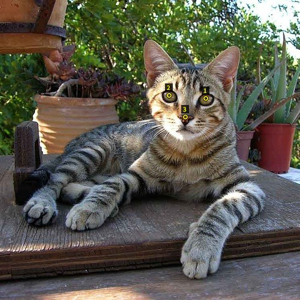
    </td>
    <td align="center">
      
    </td>
  </tr>
</table>


**Example 2: Text prompted detection**

Detect keypoints in the window of entire image:
```
python3 test_real_world/single_obj_gkd_inference.py \
    --cfg_file test_real_world/configs/gkd.yaml \
    --checkpoint output/GKDT-L_for_app/model/gkd_fullset.best \
    --input_im test_real_world/ims1/2007_007524.jpg \
    --kps_texts 'nose' 'left eye' 'right eye' 'left ear' 'right ear' \
    --skeleton 1 2 1 3 2 3 2 4 3 5
```
Or detect keypoints in an ROI:
```
python3 test_real_world/single_obj_gkd_inference.py \
    --cfg_file test_real_world/configs/gkd.yaml \
    --checkpoint output/GKDT-L_for_app/model/gkd_fullset.best \
    --input_im test_real_world/ims1/2007_007524.jpg \
    --bbox_on_input_im 33 38 241 310 \
    --kps_texts 'nose' 'left eye' 'right eye' 'left ear' 'right ear' \
    --skeleton 1 2 1 3 2 3 2 4 3 5
```
Given text prompts `nose, left eye, right eye, left ear, right ear`, the detection results are:

<table>
  <tr>
    <td align="center">
      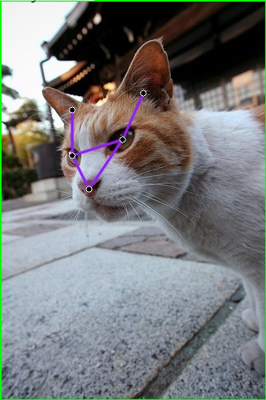
    </td>
    <td align="center">
      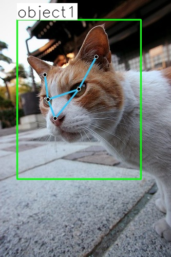
    </td>
  </tr>
</table>


**Example 3: Multimodal prompted detection**
```
python3 test_real_world/single_obj_gkd_inference.py \
    --cfg_file test_real_world/configs/gkd.yaml \
    --checkpoint output/GKDT-L_for_app/model/gkd_fullset.best \
    --input_im test_real_world/ims1/2007_007524.jpg \
    --kps_texts 'left eye' 'right eye' 'nose' \
    --support_im test_real_world/ims1/2007_003778.jpg \
    --support_kps 343 166 281 158 311 197 \
    --skeleton 1 2 1 3 2 3
```


**Example 4: Cross-object prompted detection**
```
python3 test_real_world/single_obj_gkd_inference.py \
    --cfg_file test_real_world/configs/gkd.yaml \
    --checkpoint output/GKDT-L_for_app/model/gkd_fullset.best \
    --input_im test_real_world/ims1/2007_007524.jpg \
    --kps_texts 'left eye' 'right eye' 'nose' \
    --support_im test_real_world/ims1/alpaca_150.jpg \
    --support_kps 615 495 483 493 521 549
```

<table>
  <tr>
    <td align="center">
      
    </td>
    <td align="center">
      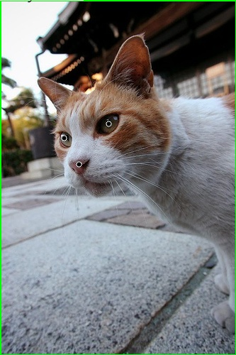
    </td>
  </tr>
</table>


**Example 5: Detection by using object name to retrieve predefined keypoint names**

Detect keypoints on chair image
```
python3 test_real_world/single_obj_gkd_inference.py \
    --cfg_file test_real_world/configs/gkd.yaml \
    --checkpoint output/GKDT-L_for_app/model/gkd_fullset.best \
    --input_im test_real_world/ims1/00000016.jpg \
    --obj_type 'chair' 
```

Detect keypoints on hand x-ray image
```
python3 test_real_world/single_obj_gkd_inference.py \
    --cfg_file test_real_world/configs/gkd.yaml \
    --checkpoint output/GKDT-L_for_app/model/gkd_fullset.best \
    --input_im test_real_world/ims1/3144.png \
    --obj_type 'hand_xray' 
```

<table>
  <tr>
    <td align="center">
      
    </td>
    <td align="center" width="50%">
      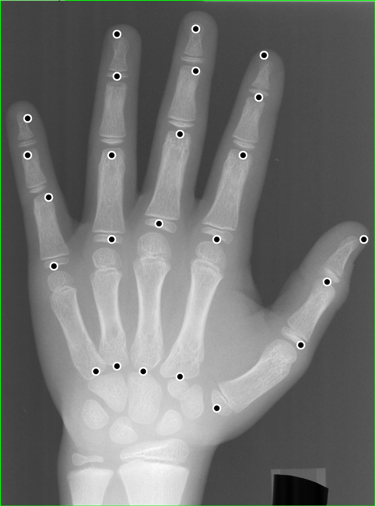
    </td>
  </tr>
</table>

You can also enrich the predefined keypoint texts in `test_real_world/predefined_keypoints.py` by yourselves!


### 4.3 Multi-Object General Keypoint Detection
Please check the detection examples in `test_real_world/scripts/eval_multi_obj_gkd.sh`. The meaning of input parameters are detailed in `test_real_world/multi_obj_gkd_inference.py`.

Go to path of `General-Keypoint-Detection/` and then follow below commands to conduct some detections.

**Example 1: Detection on quadrupedal animals given keypoint texts**

Detecting keypoints using object detector LocateAnything model
```
python3 test_real_world/multi_obj_gkd_inference.py \
    --cfg_file test_real_world/configs/gkd.yaml \
    --checkpoint output/GKDT-L_for_app/model/gkd_fullset.best \
    --input_im test_real_world/ims1/alpaca_150.jpg \
    --obj_type 'alpaca' \
    --kps_texts 'left eye' 'right eye' 'left ear' 'right ear' 'nose' 'throat' 'withers' 'tail' 'left-front leg' 'right-front leg' 'left-back leg' 'right-back leg' 'left-front knee' 'right-front knee' 'left-back knee' 'right-back knee' 'left-front paw' 'right-front paw' 'left-back paw' 'right-back paw' \
    --skeleton 5 1 5 2 1 3 2 4 7 8 7 9 9 13 13 17 7 10 10 14 14 18 8 11 11 15 15 19 8 12 12 16 16 20 6 7 6 5 \
    --object_detector locateanything
```
Given text prompts `left eye, right eye,..., right-back paw`, the detection results are:
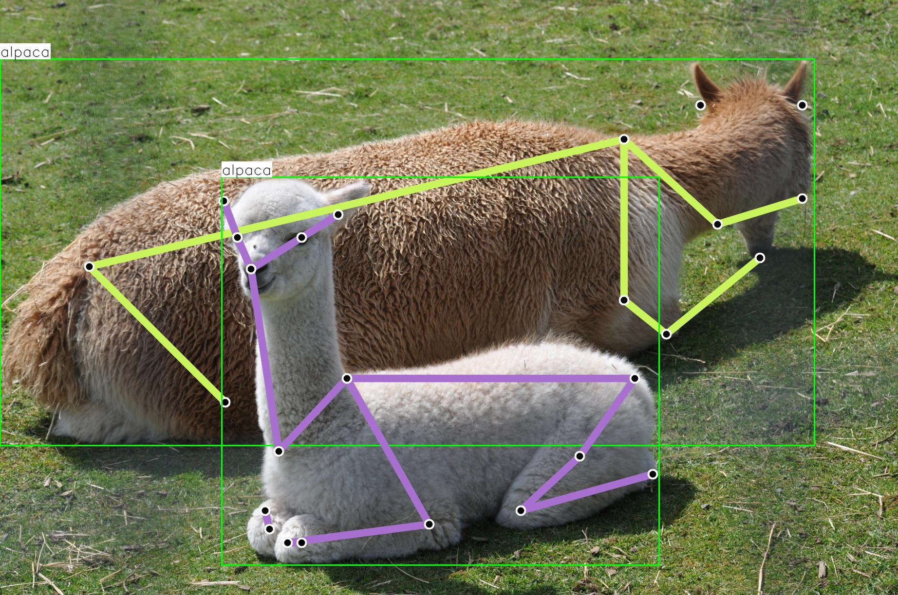

You can also switch the object detector to Grounding DINO by setting `--object_detector groundingdino`

**Example 2: Detection on quadrupedal animals by object names**
```
python3 test_real_world/multi_obj_gkd_inference.py \
    --cfg_file test_real_world/configs/gkd.yaml \
    --checkpoint output/GKDT-L_for_app/model/gkd_fullset.best \
    --input_im test_real_world/ims1/cat_dog.jpg \
    --obj_type 'cat, dog' \
    --object_detector locateanything
```
Given object names `cat, dog`, the the detection results are:
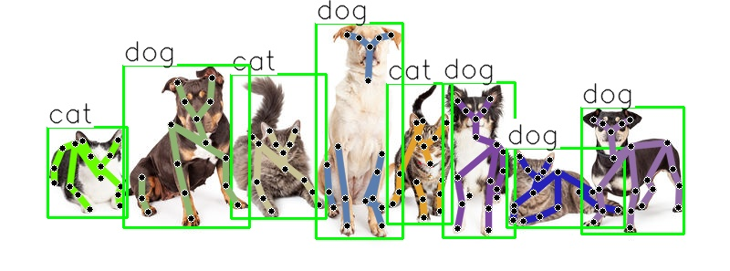


**Example 3: Detection on human pose (including real human, human sculptures, and paintings, etc.)**
```
python3 test_real_world/multi_obj_gkd_inference.py \
    --cfg_file test_real_world/configs/gkd.yaml \
    --checkpoint output/GKDT-L_for_app/model/gkd_fullset.best \
    --input_im test_real_world/ims1/000000011511.jpg \
    --obj_type 'human' \
    --object_detector locateanything
```
Given the name `human`, the the detection results are:
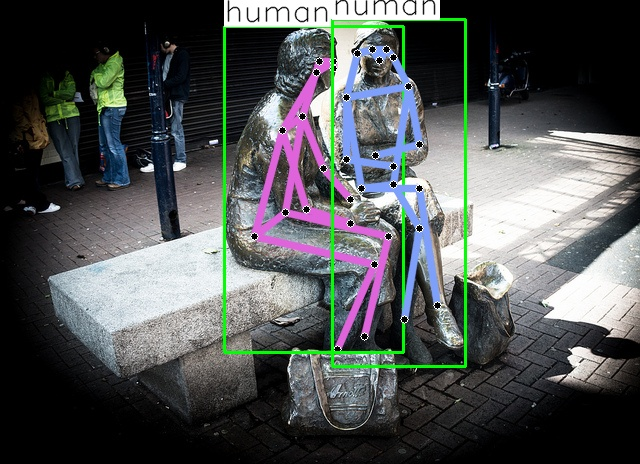

**Example 4: Detection on hand keypoints on egocentric image (which may help for robot learning)**
```
python3 test_real_world/multi_obj_gkd_inference.py \
    --cfg_file test_real_world/configs/gkd.yaml \
    --checkpoint output/GKDT-L_for_app/model/gkd_fullset.best \
    --input_im test_real_world/ims1/wash_dishes_egocentric.jpg \
    --obj_type 'human_hand' \
    --object_detector locateanything
```
Given the name `human_hand`, the the detection results are:
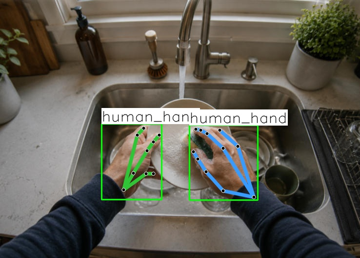

Note that the invisible keypoints are not shown as their confidence scores are low.

**Example 5: Detection on vehicles for autonomous driving**
```
python3 test_real_world/multi_obj_gkd_inference.py \
    --cfg_file test_real_world/configs/gkd.yaml \
    --checkpoint output/GKDT-L_for_app/model/gkd_fullset.best \
    --input_im test_real_world/ims1/car_penn2_0_1931.jpg \
    --obj_type 'car, bus, truck' \
    --object_detector locateanything
```
Given the names `car, bus, truck`, the the detection results are:
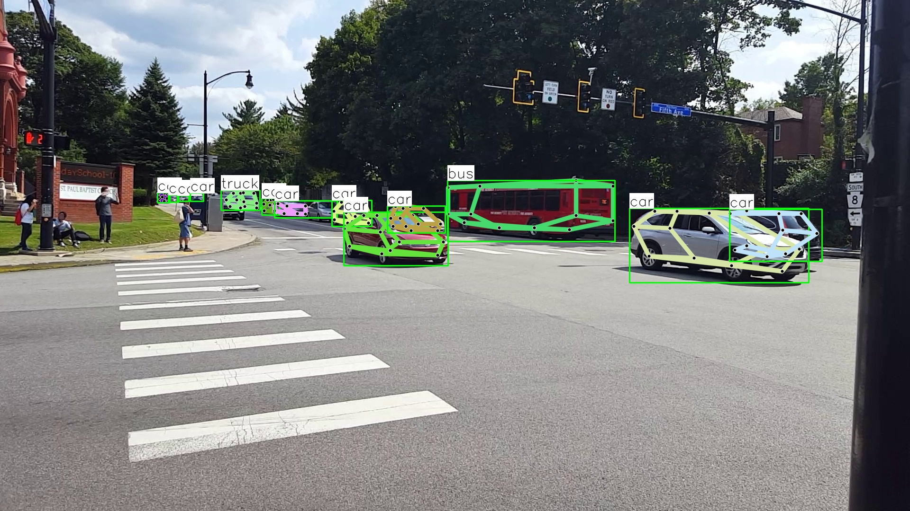

**Example 6: Detection on pigs for stock farming in agriculture**
```
python3 test_real_world/multi_obj_gkd_inference.py \
    --cfg_file test_real_world/configs/gkd.yaml \
    --checkpoint output/GKDT-L_for_app/model/gkd_fullset.best \
    --input_im test_real_world/ims1/pigs_stock_farming.jpg \
    --obj_type 'pig' \
    --object_detector locateanything
```
Given the name `pig`, the the detection results are:
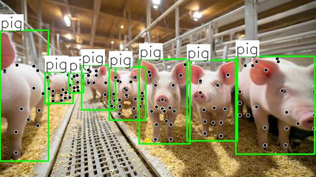

**Example 7: Detection on birds**
```
python3 test_real_world/multi_obj_gkd_inference.py \
    --cfg_file test_real_world/configs/gkd.yaml \
    --checkpoint output/GKDT-L_for_app/model/gkd_fullset.best \
    --input_im test_real_world/ims1/pet_birds.jpg \
    --obj_type 'bird' \
    --object_detector locateanything
```
Given the name `bird`, the the detection results are:
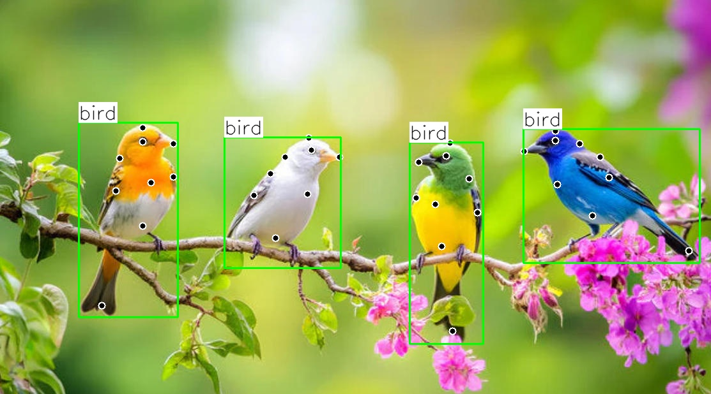

**Example 8: Detection on fishes**
```
python3 test_real_world/multi_obj_gkd_inference.py \
    --cfg_file test_real_world/configs/gkd.yaml \
    --checkpoint output/GKDT-L_for_app/model/gkd_fullset.best \
    --input_im test_real_world/ims1/fish_swim.jpg \
    --obj_type 'fish' \
    --object_detector locateanything
```
Given the name `fish`, the the detection results are:
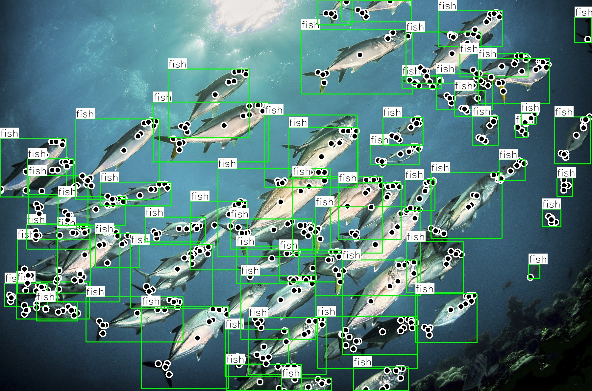


## 5. MegaKPT Dataset
For the preparation of MegaKPT dataset, please see [`MegaKPT/README_for_MegaKPT.md`](MegaKPT/README_for_MegaKPT.md)


## 6. Model Training and Evaluation
### 6.1 GKD Model Training
After preparing MegaKPT dataset, please check `datasets/dataset_meta_info.py` where defines the relative paths of image root and annotation root of each dataset. If they are correct, then we are able to perform GKD training and evaluation. All the train \& val codes are in `main_gkd.py`.

Firstly, please download [DINOv3 ViT models](https://github.com/facebookresearch/dinov3) to `/your/path/to/pretrained_models/dinov3/`. The folder layout is as follows:
```
|-- /your/path/to/pretrained_models/dinov3/
|   |-- dinov3_vitl16_dinotxt_vision_head_and_text_encoder-a442d8f5.pth
|   |-- pretrained_on_LVD-1689M/
|   |   |-- dinov3_vits16_pretrain_lvd1689m-08c60483.pth
|   |   |-- dinov3_vitb16_pretrain_lvd1689m-73cec8be.pth
|   |   |-- dinov3_vitl16_pretrain_lvd1689m-8aa4cbdd.pth
|   |   |-- dinov3_vith16plus_pretrain_lvd1689m-7c1da9a5.pth
```

Then, replace the DINOv3 weights root and dataset root to yours in `experiments/configs/gkd.yaml`. Our code also supports [CLIP visual/textual encoders](https://github.com/openai/CLIP), but you can ignore CLIP weights root if you use DINOv3. 

***For one GPU training*** of large size of GKDT model, please run
```
python3 main_gkd.py --cfg_file experiments/configs/gkd.yaml \
    OUTPUT_DIR output/GKDT-L_1GPU
```
Once it is successfully trained, you can find a model (i.e., `gkd.best`) appeared in folder `output/GKDT-L_1GPU/model` with the same name to the config file (i.e., `gkd.yaml`).

You can set `TRAIN.NUM_ROLL_OUT` to adjust the number of episodes for training at a time, and `TRAIN.TEXT_PROMPT_SETTING.NUM_TEXT` and `TRAIN.NUM_TRAIN_SHOT` to be 1 or 0 to enable text, visual or multimodal prompted training. The mix-modal prompted training only has effect when both text prompts and visual prompts are available as it performs random masking one modality of prompts.

***For distributed multi-GPU training***, we provide a slurm based script `experiments/study_archs/GKDT-L.sh`. Go to path `experiments/study_archs`, then change the related info (slurm partition, account, and paths of gkd environment) to yours and then simply run
```
sbatch -o GKDT-L.out GKDT-L.sh
```

### 6.2 GKD Evaluation
To comprehensively evaluate the model performance on 22 tests, we provide eval scripts in `experiments/study_archs/eval_GKDT_L`. Please replace the related info to yours in scripts. One GPU is enough to perform evaluation!

For 0-shot evaluation, simply run
```
bash eval_0shot.sh > eval_0shot.out &
```
If model is not found, please check if the model filename (e.g., `gkd.best`) in `OUTPUT_DIR` is consistent to the name of `CONFIG_FILE` (e.g., `gkd.yaml`).

For 1-shot evaluation, simply run
```
bash eval_1shot.sh > eval_1shot.out &
```

For multimodal prompted evaluation, simply run
```
bash eval_1shot+text.sh > eval_1shot+text.out &
```

Once they are successfully evaluated, three files (`eval_0shot.out`, `eval_1shot.out`, `eval_1shot+text.out`) will be generated in the eval folder.

We provide the `experiments/parse_result.py` to collect the results for 22 test sets. Please add the eval folder path to the `roots` list in `parse_result.py`, and simply run `python3 parse_result.py`, a table `all_results.csv` will be generated in eval folder.


### 6.3 Multi-Object GKD Evaluation
To evaluate multi-object bechmarks, we firstly use an off-the-shelf object detector to detect the bounding boxes of object instances, and then store these results into a COCO-format json file. Next, our GKDT loads this json file and detects the keypoints for each object instance, where the detected keypoints will update this json file, yielding the final results. This fashion follows top-down detection, with the advantage of achieving better scores if using more advanced object detector.

For evaluation of multi-human pose estimation in COCO and HumanArt:
- If using ground-truth bounding box, please see the examples in `expert_benchmark/evaluation`
- If using the detection results from Grounding DINO, simply place the resultant json file in the same root to the GT annotations, and then change the json filename in input parameter `DATASET.TEST_DATA`. Please see the example `more_investigate/top_down_get_GKD_json_results/eval_coco.sh`.

For evaluation of animals and vehicle in multi-object scenario, please see examples in `more_investigate/top_down_get_GKD_json_results`.


## 7. Continual Learning on Your Dataset
The continual learning on new dataset is very easy:

Step 1: Prepare your COCO-format dataset

Step 2: Register your dataset name and relative paths of image root and annotation root in `datasets/dataset_meta_info.py`, like as follows:
```
'carfusion': {
        'image_root': 'vehicle/carfusion/images',
        'anno_root': 'vehicle/carfusion/annotations'
    },
```

Step 3: Add one row to `DATASET.TRAIN_DATA` in config file `gkd.yaml` like as follows
```
- ['carfusion', 'car_keypoints_train.json', [], []]
``` 

After finishing above steps, the new data will be added into GKD training.


## 8. License
The source codes, models, and dataset are free for academic research and educational purposes, while commercial use is prohibited.


## 9. Citation
If you find our work helpful, please give us a star and cite our paper, thank you!
```
@inproceedings{lu2026gkdt,
  title={GKDT: General Keypoint Detection Transformer},
  author={Lu, Changsheng and Chen, Yuxin and Gui, Haokun and Wang, Rong and Yang, Jie and Yang, Harry and Hengel, Anton van den and Jia, Jiaya},
  booktitle={European Conference on Computer Vision},
  year={2026},
  organization={Springer}
}
@inproceedings{lu2024openkd,
  title={Openkd: Opening prompt diversity for zero-and few-shot keypoint detection},
  author={Lu, Changsheng and Liu, Zheyuan and Koniusz, Piotr},
  booktitle={European Conference on Computer Vision},
  pages={148--165},
  year={2024},
  organization={Springer}
}
@inproceedings{lu2022few,
  title={Few-shot keypoint detection with uncertainty learning for unseen species},
  author={Lu, Changsheng and Koniusz, Piotr},
  booktitle={2022 IEEE/CVF Conference on Computer Vision and Pattern Recognition (CVPR)},
  pages={19394--19404},
  year={2022},
  organization={IEEE}
}
```
